# PawRescue AI

A three-service platform for reporting injured animals: an anonymous reporter flow with AI-assisted triage and offline first aid guidance, and a responder dashboard for NGOs and volunteers to claim and resolve nearby cases.

## Table of contents

- [Screenshots](#screenshots)
- [Features](#features)
- [Architecture](#architecture)
- [Prerequisites](#prerequisites)
- [Installation](#installation)
- [Running the application](#running-the-application)
- [Project structure](#project-structure)
- [API reference](#api-reference)
- [Known limitations](#known-limitations)

## Screenshots

No live URL yet (see [Deployment](#architecture)) - here's the app running end to end.

**Reporter flow (no login)**

<table>
<tr>
<td width="50%">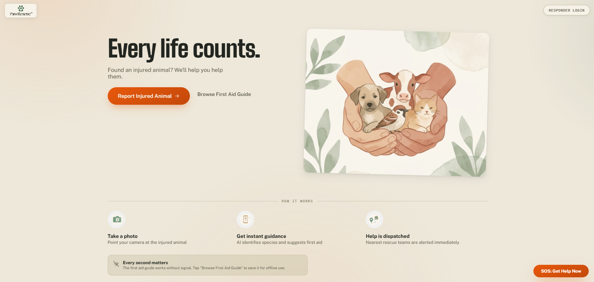<br><sub>Landing page</sub></td>
<td width="50%">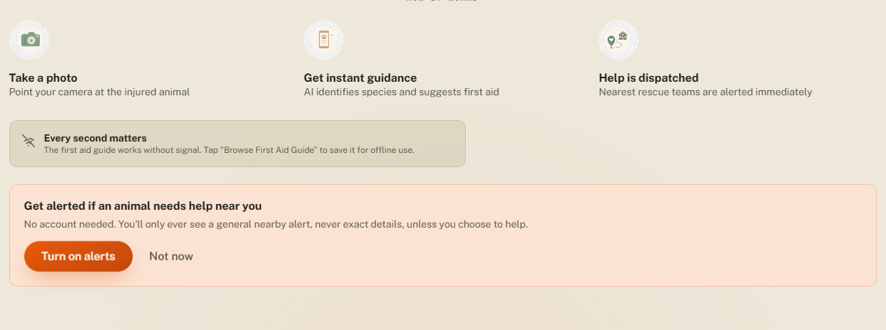<br><sub>How it works, plus the anonymous nearby-alert opt-in</sub></td>
</tr>
<tr>
<td width="50%">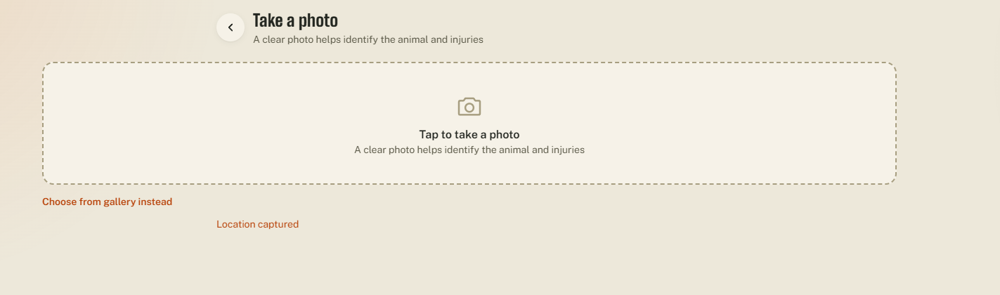<br><sub>Photo capture</sub></td>
<td width="50%">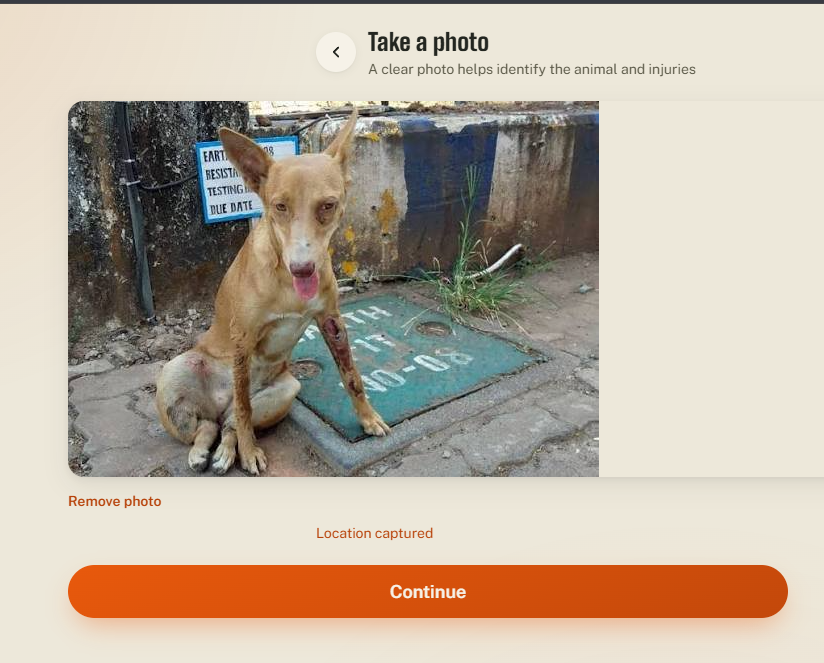<br><sub>Photo captured, location detected</sub></td>
</tr>
<tr>
<td width="50%">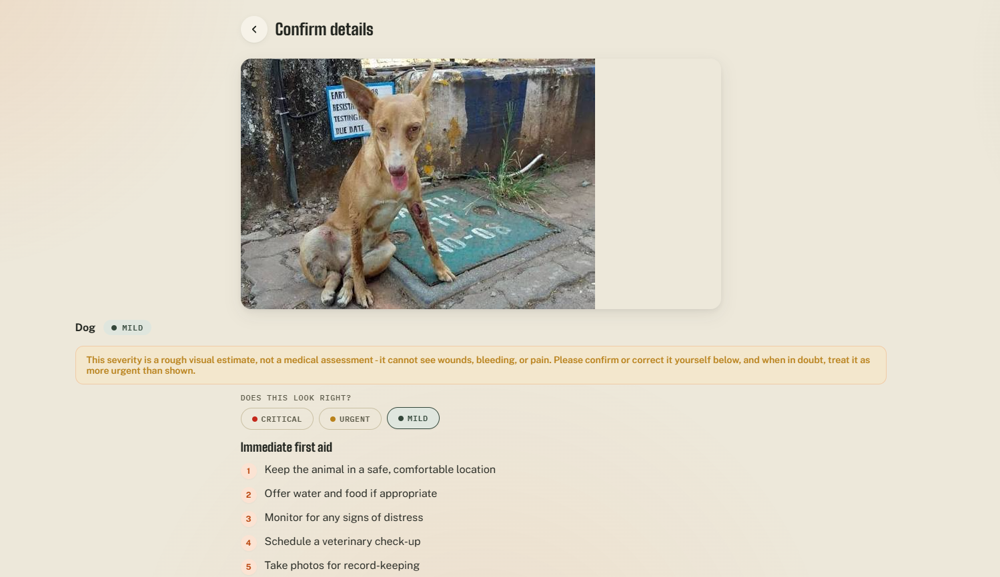<br><sub>AI triage result - species, severity estimate with disclaimer, and manual override</sub></td>
<td width="50%">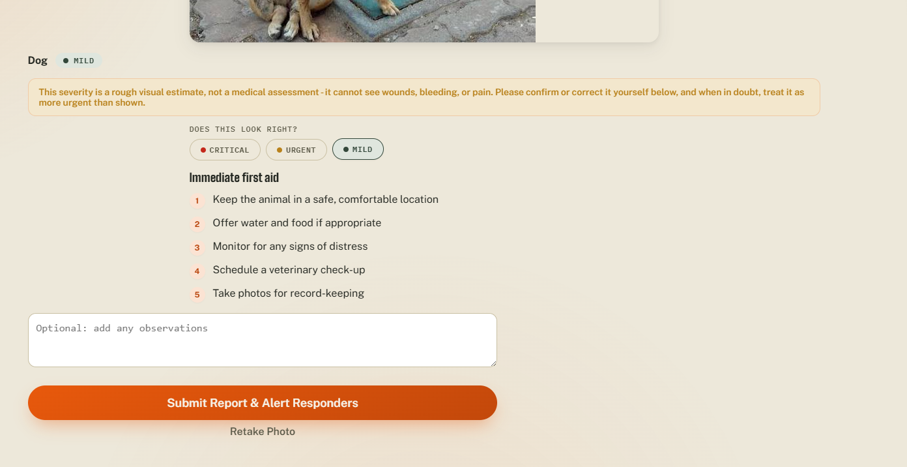<br><sub>First aid steps shown before submitting</sub></td>
</tr>
<tr>
<td width="50%">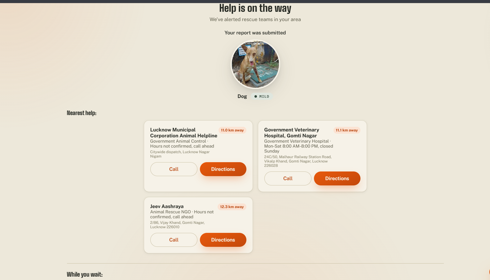<br><sub>Nearest facilities, ranked by distance</sub></td>
<td width="50%">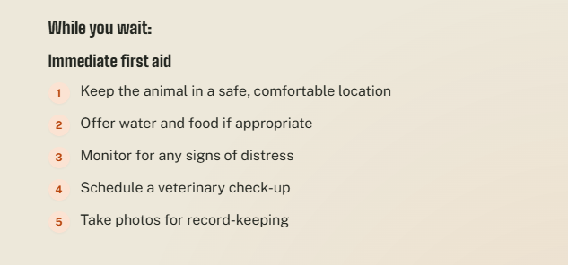<br><sub>First aid guidance while help is on the way</sub></td>
</tr>
</table>

**Responder dashboard**

<table>
<tr>
<td width="50%">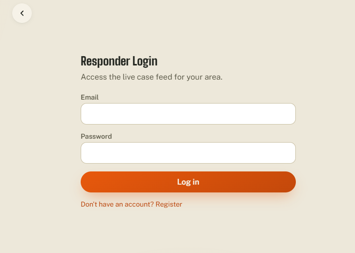<br><sub>Responder login</sub></td>
<td width="50%">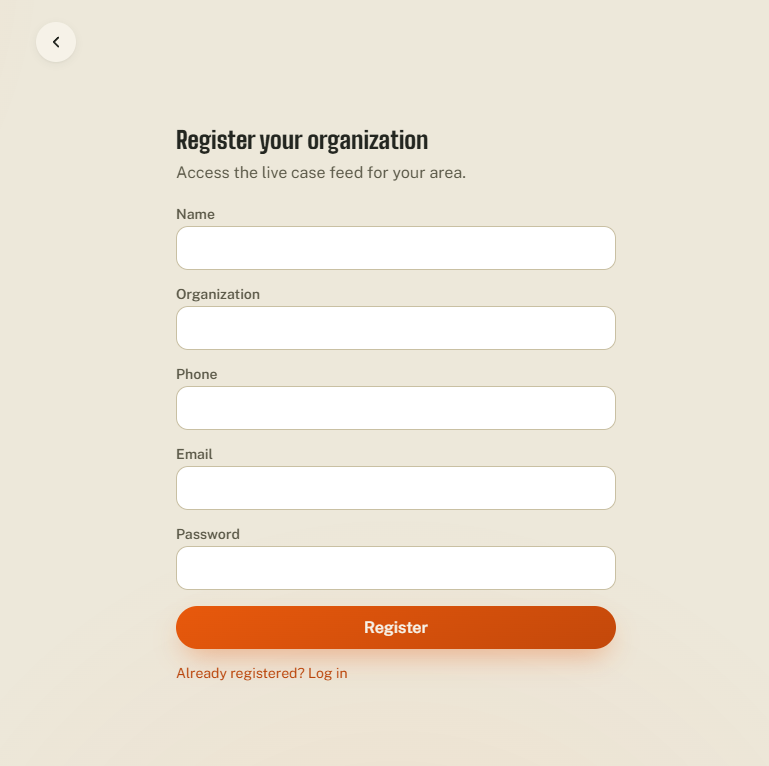<br><sub>Organization registration</sub></td>
</tr>
<tr>
<td colspan="2">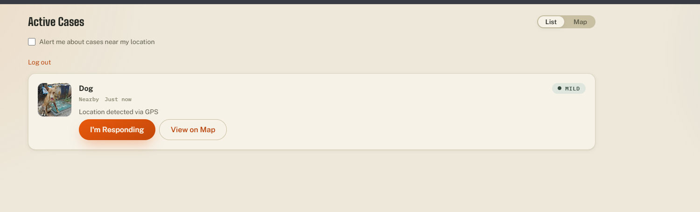<br><sub>Live case feed (list view)</sub></td>
</tr>
</table>

## Features

**Reporter flow (no login required)**
- Photo capture with automatic client-side compression before upload
- Silent GPS capture with a manual location fallback if permission is denied
- AI-assisted species and severity triage, with the nearest facilities and first aid steps shown immediately after submission
- An always-visible SOS action for calling the helpline, sending a location via WhatsApp, or jumping to the nearest facility
- An offline first aid library, searchable and filterable by species, that works without a network connection

**Responder dashboard**
- Email and password login (JWT-based)
- A live case feed sorted by severity, then distance, then time reported
- A map view of active cases (Leaflet)
- Claim and resolve actions per case

**Engineering**
- Progressive Web App: installable, works offline for the first aid library, service worker with network-first API caching and cache-first static assets
- Consistent `{ success, data }` / `{ success: false, error }` response shape across the API
- Rate limiting, input sanitization, and coordinate validation on the backend
- Automated tests: Vitest and React Testing Library on the frontend, Jest and Supertest on the backend
- GitHub Actions CI: backend tests, frontend tests and build, and GitHub Pages deploy on merge to main

## Architecture

```
Frontend (React + Vite, PWA)  --POST /api/report-->  Backend (Express)
                                                            |
                                    +-----------------------+-----------------------+
                                    |                        |                      |
                           AI service (FastAPI)     Postgres (Supabase)     facilities.json
                     species + severity triage    cases/responders/etc.   (Haversine distance)
```

| Service | Port | Stack |
|---|---|---|
| Frontend | 5173 (dev) | React 18, Vite, vanilla CSS design tokens |
| Backend | 5000 | Node.js, Express, JWT auth, Helmet, rate limiting, `pg` |
| AI service | 8001 | Python, FastAPI, PyTorch/torchvision (MobileNetV2), Pillow, NumPy |

**Deployment**: frontend on Vercel, backend + AI service on Render (`render.yaml` at the repo root; AI service is a private Render service, not reachable from the public internet at all - only the backend can call it, over a shared-secret-authenticated request), Postgres on Supabase. Two free-tier behaviors worth knowing before assuming something's broken:
- **Render's free services cold-start** after ~15 minutes of no traffic - the first request after a quiet period can take 30-60s while the instance spins back up.
- **Supabase free projects pause after 7 days of no activity** and need a manual "restore" click from the Supabase dashboard before the database responds again.

Supabase's *direct* database connection host (`db.<ref>.supabase.co`) is IPv6-only; use the connection **pooler** string instead (Supabase dashboard → Project Settings → Database → Connection Pooling → Connection string, mode: Transaction) for `DATABASE_URL`, since many hosts/networks - including some sandboxes and CI runners - have no IPv6 egress at all.

**CI setup**: the backend test job needs `DATABASE_URL` as a **GitHub repository secret** (Settings → Secrets and variables → Actions → New repository secret, name `DATABASE_URL`, value the same pooler connection string as above) - tests run against an isolated `test_paw_rescue` schema inside that same database, truncated at the start of every run, so this never touches real data.

## Prerequisites

| Software | Version |
|---|---|
| Node.js | 20 or higher |
| npm | 9 or higher |
| Python | 3.10 or higher |
| pip | latest |

## Installation

```bash
git clone <repository-url>
cd paw-rescue
```

**AI service**
```bash
cd ai-service
python -m venv venv
venv\Scripts\activate        # on macOS/Linux: source venv/bin/activate
pip install -r requirements.txt
```
This pulls in CPU-only PyTorch/torchvision (a few hundred MB) and downloads MobileNetV2's pretrained weights (~14MB) on first run; expect the first install and first startup to be slower than the other two services.

**Backend**
```bash
cd backend
npm install
cp .env.example .env         # fill in JWT_SECRET, DATABASE_URL (Supabase pooler string - see Architecture), etc.
```
Tables are created automatically on first boot (`initializeDB()` applies every file in `migrations/` - they're all `CREATE TABLE IF NOT EXISTS`, safe to run repeatedly). If you have existing `db.json`/`volunteer-locations.json` data worth keeping from before this project used Postgres, run `node migrations/migrate-json-to-postgres.js` once by hand to bring it over.

**Frontend**
```bash
cd frontend
npm install
cp .env.example .env
```
When deploying to Vercel, set `VITE_BACKEND_URL` in the project's environment variables to the deployed Render backend's URL - it's read at build time, so it must be set before building, not just at runtime.

## Running the application

Start each service in its own terminal.

```bash
# Terminal 1: AI service
cd ai-service
python main.py                # http://localhost:8001

# Terminal 2: Backend
cd backend
npm start                     # http://localhost:5000

# Terminal 3: Frontend
cd frontend
npm run dev                   # http://localhost:5173
```

Open http://localhost:5173 in a browser. The responder dashboard is reachable from the "Responder Login" link in the top-right corner; it requires registering an account first, there is no seed account.

## Project structure

```
paw-rescue/
  frontend/
    public/                   manifest, service worker, icons
    src/
      components/
        ui/                   Button, Card, Badge, Spinner, ErrorBoundary
        reporter/              camera capture, location, first aid card, SOS
        responder/              login, case feed, case card, map
      pages/                   ReporterPage, ResponderPage, FirstAidLibrary
      hooks/                   useGeolocation, useCamera, useOffline
      utils/                   api client, first aid data, formatters
      styles/                  design tokens, global styles
  backend/
    server.js
    middleware/                auth, sanitize, request logger
    routes/                    auth, cases, volunteers
    utils/                     db (Postgres queries), pgPool, distance, response helpers
    migrations/                001_init.sql, apply.js, migrate-json-to-postgres.js (one-time, manual)
    facilities.json
  ai-service/
    main.py
    requirements.txt
  render.yaml                  Render Blueprint: backend (public) + ai-service (private)
  .github/workflows/ci.yml
```

## API reference

All responses use `{ "success": true, "data": { ... } }` on success or `{ "success": false, "error": { "code", "message" } }` on failure.

| Method | Endpoint | Auth | Description |
|---|---|---|---|
| POST | /api/report | none | Submit a report (image, notes, location); returns AI triage and nearest facilities |
| GET | /api/reports | none | List saved reports |
| POST | /api/auth/register | none | Register a responder account |
| POST | /api/auth/login | none | Log in, returns a JWT |
| GET | /api/cases | JWT | List active cases, sorted by severity then distance then time |
| POST | /api/cases/:id/respond | JWT | Claim a case |
| POST | /api/cases/:id/resolve | JWT | Mark a case resolved |
| GET | /health | none | Backend health check |
| POST | /analyze | none | AI service: image analysis (called by the backend, not the frontend directly) |
| GET | /health | none | AI service health check |

## Known limitations

- **Species detection uses a real pretrained model (MobileNetV2 on ImageNet), but severity assessment is still a heuristic.** Species classification runs actual inference and buckets ImageNet's ~120 dog breeds, cat variants, and bird species into Dog/Cat/Bird/Unknown. Severity ("Critical"/"Urgent"/"Mild"), however, has no equivalent pretrained model to draw on: it's estimated from image contrast as a rough proxy for visible trauma, with no real understanding of injuries. It will misjudge severity routinely. The reporter app surfaces this directly with a disclaimer and lets the reporter override the AI's severity call before submitting; treat the automated severity as a prompt to look closely, not a diagnosis.
- The facility list is a small, manually maintained set for the Lucknow area, not a live directory.
- There is no seeded responder account; each deployment starts with an empty responder table.
